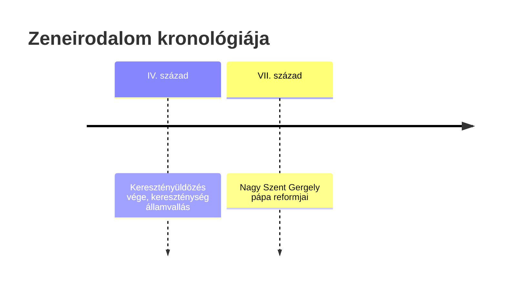

[[VII. század]]
- [[gregorián]]

[[IX. század]]
- Kottaírás: [[neuma|neumák]]
- Komponálás: [[Tropus]], [[Sequentia]]
- Többszólamúság megjelenik: [[organum]]

[[XVI. század]]
- körvonalazódik a ritmusvilág és a harmónia