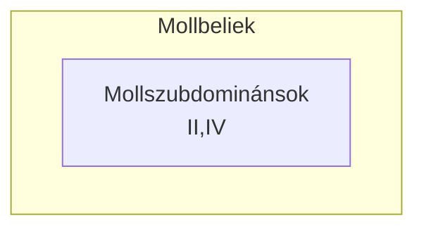

#összhangzattan #alteráltakkord 
Csak **dúrban** létező alterált akkordok. Az adott lépcsőn lévő harmóniát az azonos nevű/alapú mollból emeljük át.

A dúrbeli színezetek helyett az adott fokok mollbeli színezete csendül fel:

|         | Dúr     | moll |
| ------- | ------- | ---- |
| I       | dúr     | moll |
| II      | moll    | szűk |
| IV      | dúr     | moll |
| VI      | moll    | dúr  |
| $VII^7$ | félszűk | szűk |
A *mollbeli* akkordok közül a II és IV fokok a *mollszubdominánsok*. 

$\underset{mb}{VI}$: V után jön, változatos formában használatos.

# Feladat
Díszítés, színezés.

# Funkció
Változó
# Jele
## Mollbeli: mb
$\underset{mb}{VI}=$ “mollbeli hat”
## Mollszubdomináns: mS
$\underset{mS}{II^6_5}=$ “mollszubdomináns kettő kvintszext”

